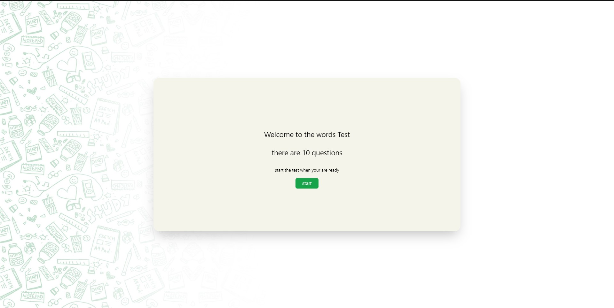
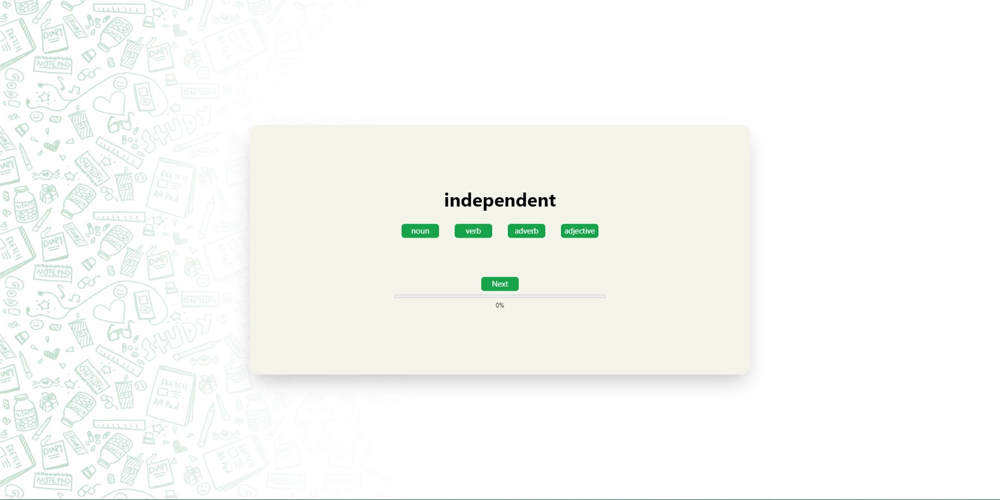
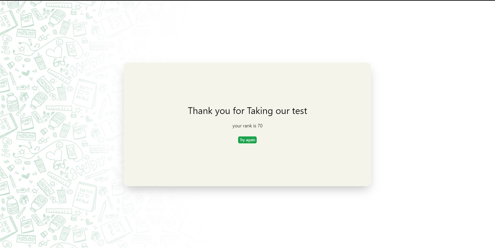

# nagwa-assesment

In English language, words can be categorized according to their syntactic functions, which is known as "Part of Speech".
Examples of part of speech: (noun, verb, adjective, ...)

This app is to test student by giving them a wrod and asking them to choose its part of speech

## How to run

Note: you have to have Nodejs installed on your machine

### Backend

1. Clone the repo to a local directory
2. Open your terminal and navigate inside the folder named server
3. Open the terminal and run "npm install" to install all dependecies
4. Run "nodemon index.js" to run the backend server

Note: backend server will run on port 3000 by default

### Frontend

1. Open the words-test directory inside front directory with VScode or any other editor
2. Open the terminal and run "npm install" to install all dependecies
3. Run "npm start --port 8000" to run the app .. the default is port 3000 as well so we changed it to 8000

you should see the home page

## How to use

1. Click on the start button to start the test
2. The progress bar shows you how much percent of the test have you finished
3. If the answer is correct, the correct flag will appear, if it is not correct, an incorrect flag will appear

4. Finally after you finish answering, you rank with respect to the other students will appear on the screen
5. You can akways try again if you want by clicking the try again button

